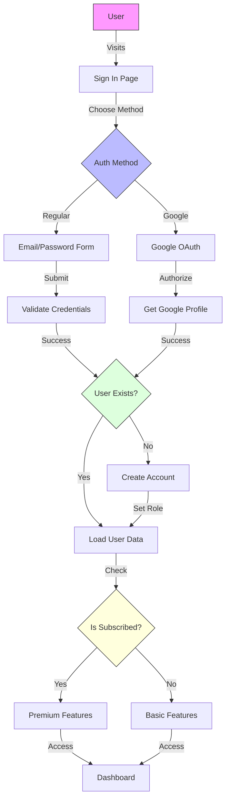
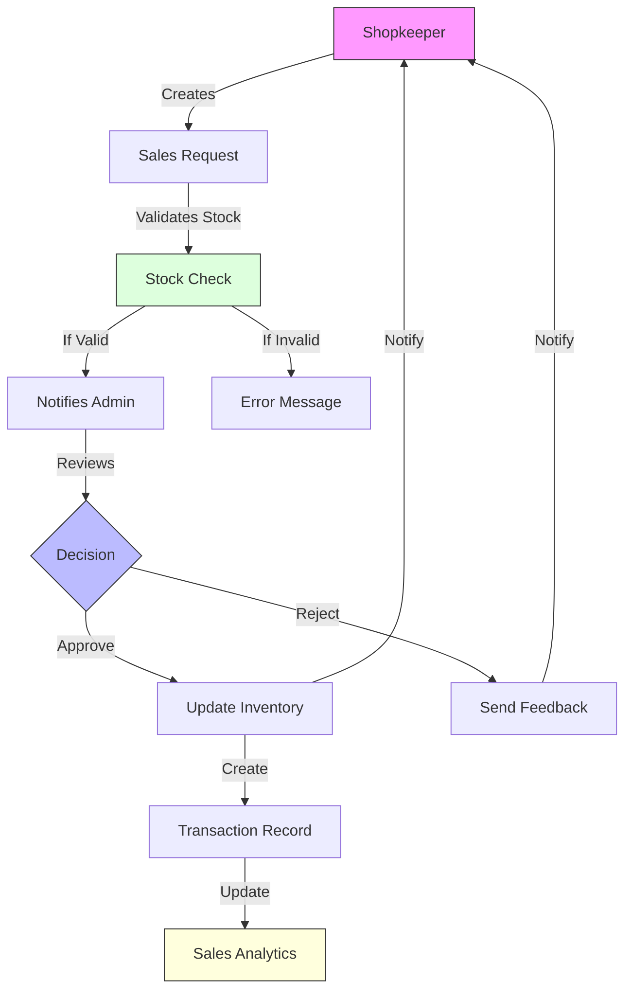
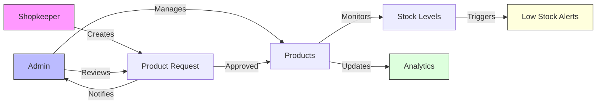

# Jewelry Shop Inventory Management System

A comprehensive jewelry shop management system built with Next.js, featuring role-based authentication, inventory management, and sales request workflows.

## Implemented Features

### 1. User Management 👥
The system implements role-based access control (RBAC) with two user types:
- **Admin (Owner)**: Full control over inventory and sales approval
- **Shopkeeper (Worker)**: Can browse products and create sales requests

Additional user features:
- 🔐 Google Sign-In integration
- ⭐ Premium subscription system
- 👤 User profile management

### 2. Product Management 💎
Products are managed with jewelry-specific attributes:
- 📦 Product ID tracking
- 📝 Detailed product information (name, description, category)
- 🏷️ Material specification
- 💰 Price and stock management
- 🖼️ Image support
- 📊 Automated inventory tracking
- ⚠️ Low stock threshold alerts
- 📋 Product request workflow (Add/Edit/Delete)

### 3. Sales Management 💫
Comprehensive sales handling system:
- 🛍️ Single/bulk sales request creation
- 👥 Customer information tracking
- ✅ Real-time stock validation
- 🧮 Automated total value calculation
- 📈 Sales analytics and reporting
- 📜 Complete transaction history
- 🏷️ Unique request ID generation (Format: SR-YYYY-XXXX)

### 4. Notification System 🔔
Real-time notifications for:
- 📫 Sales request status updates
- 🆕 New request notifications
- 📊 Low stock alerts
- 📱 Unread notification tracking
- 🔄 Interactive notification interface

## System Workflows

### Authentication Workflow


### Sales Request Workflow


### Product Management Workflow


## Getting Started

### Prerequisites
- Node.js (v14 or later)
- PostgreSQL database
- NPM or Yarn

### Installation

1. Clone the repository:
```bash
git clone [repository-url]
cd jewelry-management-system
```

2. Install dependencies:
```bash
npm install
```

3. Set up environment variables:
Create a `.env.local` file with required configuration.

4. Initialize the database:
```bash
npx prisma db push
npx prisma generate
```

5. Start the development server:
```bash
npm run dev
```

## Tech Stack

- **Frontend**: Next.js with TypeScript
- **Database**: PostgreSQL with Prisma ORM
- **UI Components**: Custom components with Tailwind CSS
- **State Management**: React Hooks
- **API**: Next.js API routes
- **Analytics**: Built-in sales and inventory analytics
- **Authentication**: NextAuth.js with Google Sign-In

## License

This project is licensed under the MIT License.
