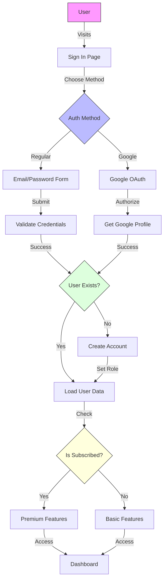
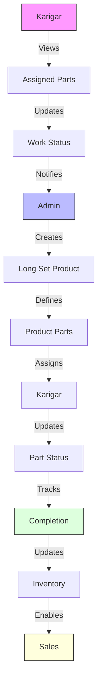
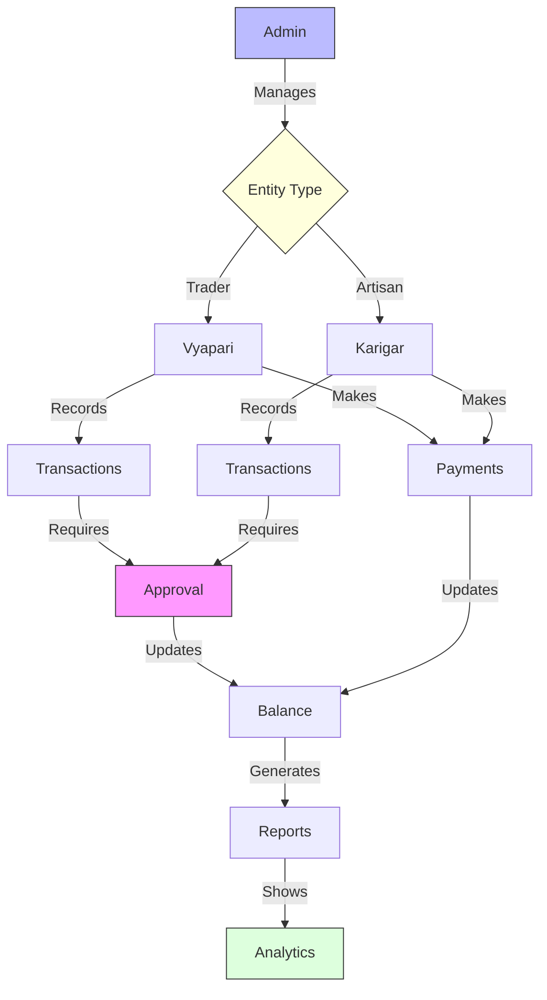
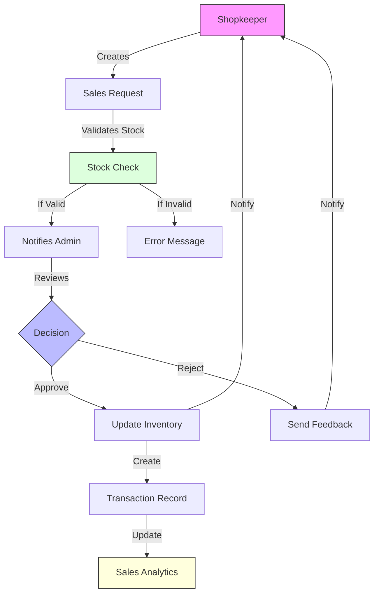
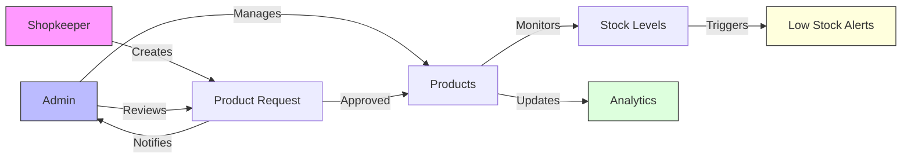

# Jewelry Shop Inventory Management System

A comprehensive jewelry shop management system built with Next.js, featuring role-based authentication, inventory management, and sales request workflows.

## Implemented Features

### 1. User Management 👥
The system implements role-based access control (RBAC) with enhanced admin capabilities:
- **Admin (Owner)**
  - 🔐 Full system control
  - 👤 User role management
  - 📝 Action logging
  - 🔄 Role modification
  - 🚫 User deletion
  - 👁️ Face authentication (upcoming)
- **Shopkeeper (Worker)**
  - 🛍️ Browse products
  - 📋 Create sales requests
  - 📦 View inventory

Additional user features:
- 🔐 Google Sign-In integration
- ⭐ Premium subscription system
- 👤 User profile management
- 📝 Activity logging

### 2. Product Management 💎
Products are managed with jewelry-specific attributes:
- 📦 Product ID tracking
- 📝 Detailed product information
- 🏷️ Material specification
- 💰 Price and stock management
- 🖼️ Image support
- 📊 Automated inventory tracking
- ⚠️ Low stock threshold alerts
- 📋 Product request workflow

### 3. Long Set Product Management 💍
Specialized system for managing complex jewelry sets:
- 📦 Multi-part product tracking
- 👨‍🔧 Karigar (artisan) assignment per part
- 💰 Individual part cost tracking
- 📊 Consolidated pricing
- 🔄 Inventory synchronization
- 📝 Detailed part descriptions
- 🏷️ SKU management for sets
- 📈 Part-wise progress tracking

### 4. Sales Management 💫
Comprehensive sales handling system:
- 🛍️ Single/bulk sales request creation
- 👥 Customer information tracking
- ✅ Real-time stock validation
- 🧮 Automated total value calculation
- 📈 Sales analytics and reporting
- 📜 Complete transaction history
- 🏷️ Unique request ID generation
- 💳 Payment tracking

### 5. Khata Book System 📒
Comprehensive financial tracking for traders and artisans:
- 👥 Vyapari (Trader) management
- 👨‍🎨 Karigar (Artisan) management
- 💳 Payment tracking and approvals
- 📋 Transaction records
- 💼 Balance sheet management
- 🔄 Automatic balance updates
- 📱 Mobile-friendly interface
- ✅ Multi-level approval system
- 📊 Financial analytics
- 🔍 Transaction history search
- 💰 Outstanding balance tracking
- 📅 Payment schedule management

### 6. Advanced Billing System 🧾
Automated billing with GST support:
- 🏷️ GST/Non-GST bill generation
- 📊 SGST/CGST/IGST calculation
- 🏢 Business details management
- 📝 HSN code support
- 🚛 Transport details tracking
- 💼 Place of supply tracking
- 🔄 Automatic numbering
- 📱 Mobile-friendly printing
- 📨 Email bill option
- 💾 PDF generation
- 🔍 Bill search and filtering
- 📁 Bill archiving

### 7. Enhanced Dashboards 📊
Multiple specialized dashboards:
- **Inventory Dashboard**
  - 📦 Stock level monitoring
  - ⚠️ Low stock alerts
  - 📈 Stock trend analysis
  - 🔄 Reorder suggestions
  
- **Sales Dashboard**
  - 💰 GST/Non-GST sale filtering
  - 📊 Revenue analytics
  - 📈 Sales trends
  - 🎯 Target tracking
  
- **Khata Book Dashboard**
  - 💳 Payment tracking
  - 📊 Balance analytics
  - 🔄 Transaction history
  - 📈 Payment trends

### 8. Notification System 🔔
Real-time notifications for:
- 📫 Sales request status updates
- 🆕 New request notifications
- 📊 Low stock alerts
- 📱 Unread notification tracking
- 🔄 Interactive notification interface

## System Workflows

### Authentication Workflow


### Long Set Product Workflow


### Khata Book Workflow


### Sales Request Workflow


### Product Management Workflow


## Getting Started

### Prerequisites
- Node.js (v14 or later)
- PostgreSQL database
- NPM or Yarn
- Modern web browser

### Installation

1. Clone the repository:
```bash
git clone [repository-url]
cd jewelry-management-system
```

2. Install dependencies:
```bash
npm install
```

3. Set up environment variables:
Create a `.env.local` file with required configuration.

4. Initialize the database:
```bash
npx prisma db push
npx prisma generate
```

5. Start the development server:
```bash
npm run dev
```

## Tech Stack

- **Frontend**: Next.js with TypeScript
- **Database**: PostgreSQL with Prisma ORM
- **UI Components**: Custom components with Tailwind CSS
- **State Management**: React Hooks
- **API**: Next.js API routes
- **Analytics**: Built-in sales and inventory analytics
- **Authentication**: NextAuth.js with Google Sign-In
- **Styling**: Tailwind CSS and Shadcn UI

## License

This project is licensed under the MIT License - see the [LICENSE](LICENSE) file for details.
