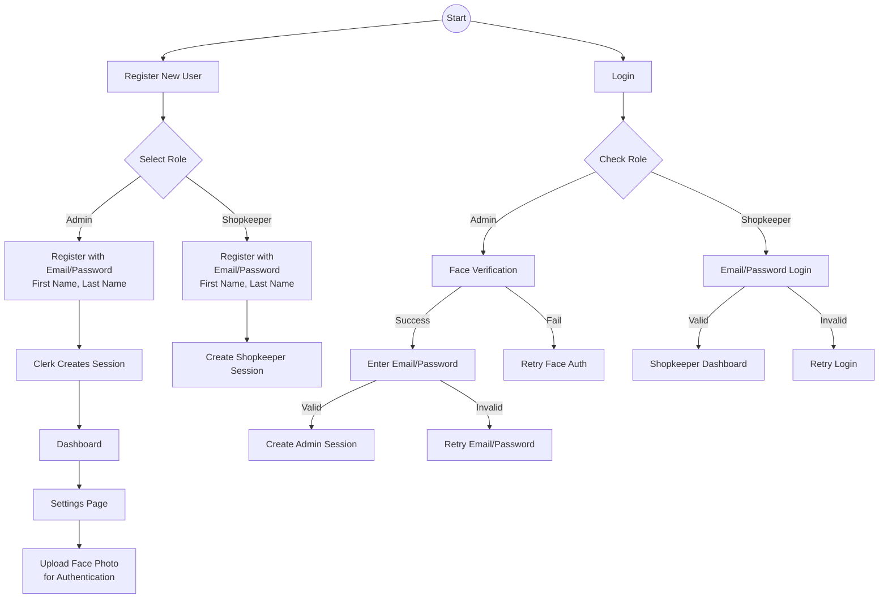

# Authentication Workflow Documentation

## Overview
This document outlines the authentication workflow for the application, which uses Clerk for authentication and implements role-based access with additional face verification for admin users.

## Workflow Diagram



## Implementation Details

### 1. Registration Flow
- **Technology**: Clerk SignUp component
- **Required Fields**:
  - Email address
  - Password
  - First name
    EmailPwd -->|Invalid| RetryEmail[Retry Email/Password]
    
    %% Shopkeeper Path
    RoleSelect -->|Shopkeeper| ShopReg[Register with<br/>Email/Password<br/>First Name, Last Name]
    ShopReg --> ShopSession[Create Shopkeeper Session]
    CheckRole -->|Shopkeeper| ShopLogin[Email/Password Login]
    ShopLogin -->|Valid| ShopDash[Shopkeeper Dashboard]
    ShopLogin -->|Invalid| RetryShop[Retry Login]
```

## Implementation Details

### 1. Registration Flow
- **Technology**: Clerk SignUp component
- **Required Fields**:
  - Email address
  - Password
  - First name
  - Last name
- **Role Selection**:
  - Uses custom RoleSelection component
  - Role stored in Clerk's publicMetadata
  - Roles: admin, shopkeeper

### 2. Admin Authentication
#### Face Photo Setup
- Location: Settings page after initial login
- Technology: face-api.js for face detection
- Storage: Secure server storage for reference photos
- Validation: Ensures clear face detection before storage

#### Login Process
1. **Face Verification (Step 1)**
   - Uses FaceAuthentication component
   - Real-time face detection and matching
   - Must match stored reference photo

2. **Clerk Authentication (Step 2)**
   - Standard email/password verification
   - Managed by Clerk authentication
   - Creates secure session upon success

### 3. Shopkeeper Authentication
- Simple email/password flow
- No face verification required
- Direct dashboard access after authentication
- Session management handled by Clerk

### 4. Security Considerations
- Face photos stored securely on server
- Server-side face verification
- Secure session management via Clerk
- Role-based access control throughout app
- Rate limiting on authentication attempts
- Secure storage of credentials

## Technical Implementation

### Key Components
1. `RoleSelection.tsx`
   - Handles role selection during registration
   - Visual interface for role choice
   - Triggers role-specific registration flow

2. `FaceAuthentication.tsx`
   - Manages face verification process
   - Integrates with face-api.js
   - Handles capture and verification logic

3. `settings/profile/page.tsx`
   - Admin face photo upload interface
   - Photo management and updates
   - Face detection validation

### API Endpoints
1. `/api/auth/face-verify`
   - Verifies face during login
   - Matches against stored reference

2. `/api/user/face-photo`
   - Handles face photo upload
   - Stores reference photos
   - Retrieves stored photos

### Libraries and Tools
- Clerk: Authentication and session management
- face-api.js: Face detection and recognition
- Next.js: Application framework
- Prisma: Database management